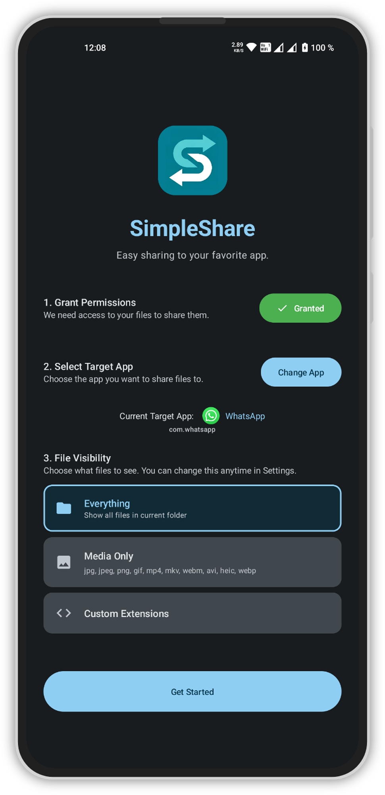
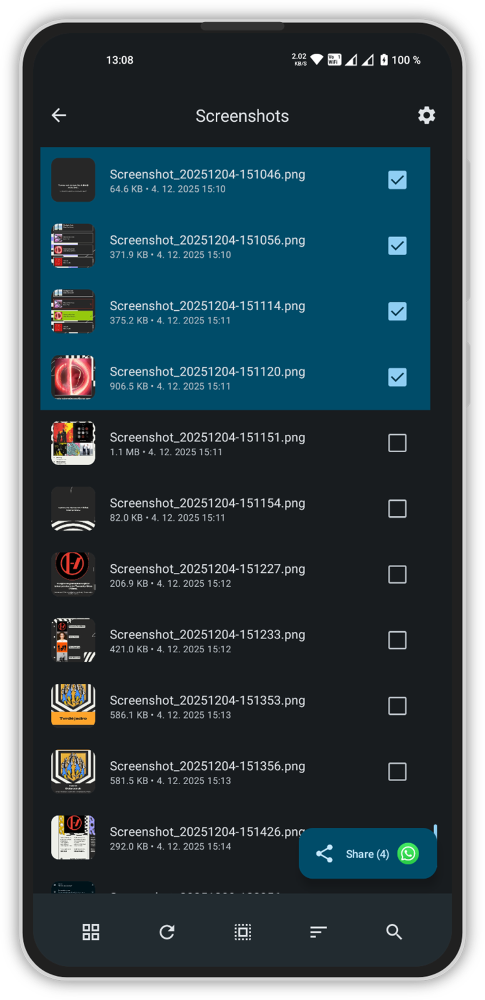
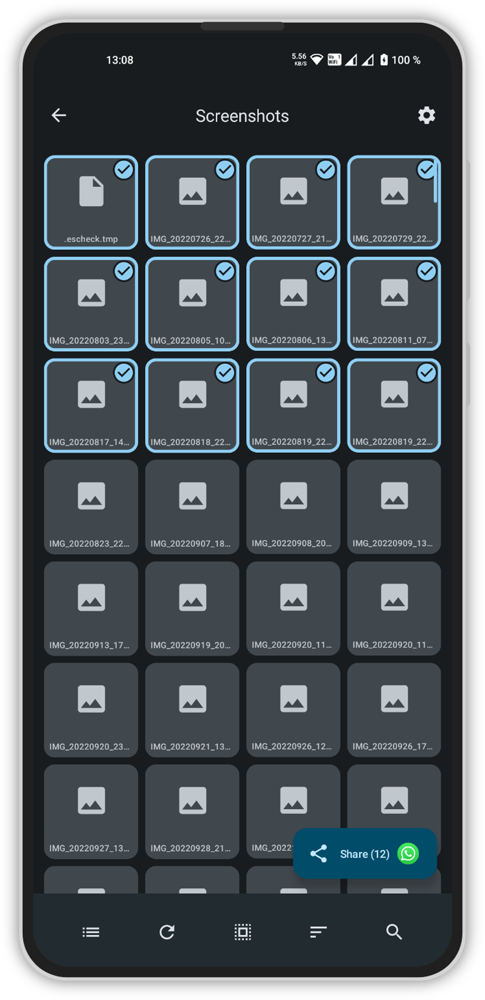
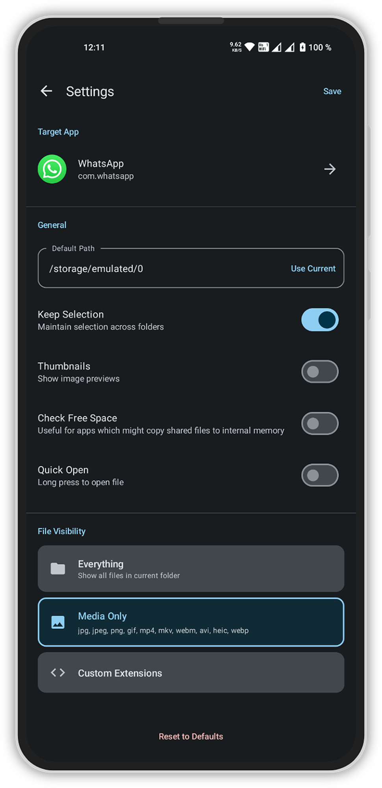
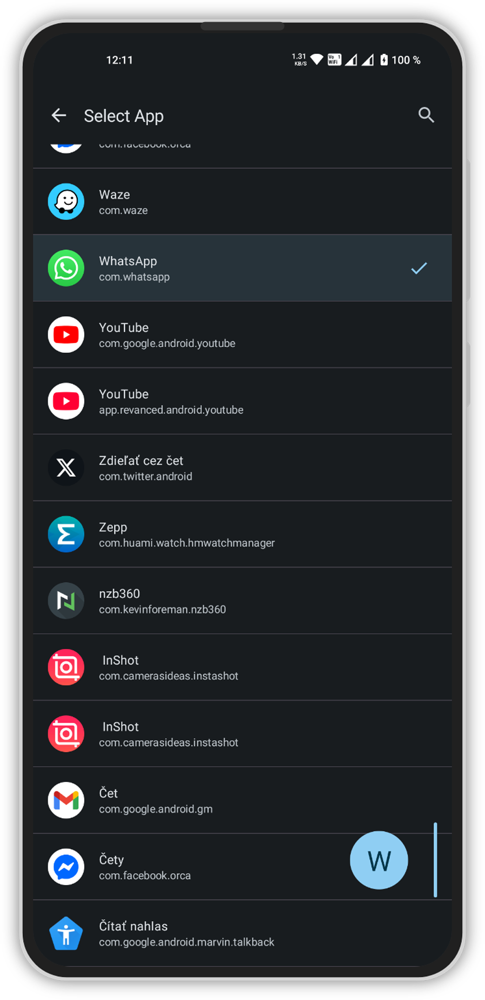

  
  

    <b>SimpleShare</b> 
    Easy file sharing to your favorite app.
     
    Supports Android 9 (Pie) and newer  

## Overview

**SimpleShare** bypasses the clumsy system share menu, letting you easily share files directly to your chosen app (e.g., Google Photos, WhatsApp, Google Drive) in a single tap.

## Features
*   **Direct-to-App Sharing**: Bypass the system menu and share instantly to your pre-selected app.
*   **Specific Actions**: Deep link sharing directly into specific chats or app modes.
*   **Smart File Browser**:
    *   Thumbnail previews
    *   Drag-to-select gesture
    *   File visibility modes
    *   Persistent file selection across folders
    *   Powerful search
*   **Customizable**: Configure your default startup folder, Automatically check for sufficient storage space before sharing (For apps that might copy shared files to cache).
*   **Modern Design**: Built with Jetpack Compose for a fluid, responsive experience.

## Screenshots

  
  
  

  
    

## Download
You can download **SimpleShare** directly from the GitHub releases page or by tapping on the badge below.

  
  

## Dependencies

*   [Jetpack Compose](https://developer.android.com/jetpack/compose) - Modern toolkit for building native UI.
*   [Glide](https://github.com/bumptech/glide) - Fast and efficient image loading framework.
*   [Accompanist](https://google.github.io/accompanist/) - Utilities for Jetpack Compose (Drawable Painter).
*   [AndroidX](https://developer.android.com/jetpack/androidx) - Core Android libraries and lifecycle components.

---

  This project was built using <b>Gemini 3 Pro</b>

